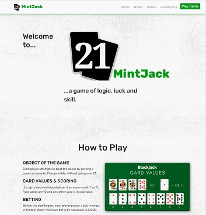
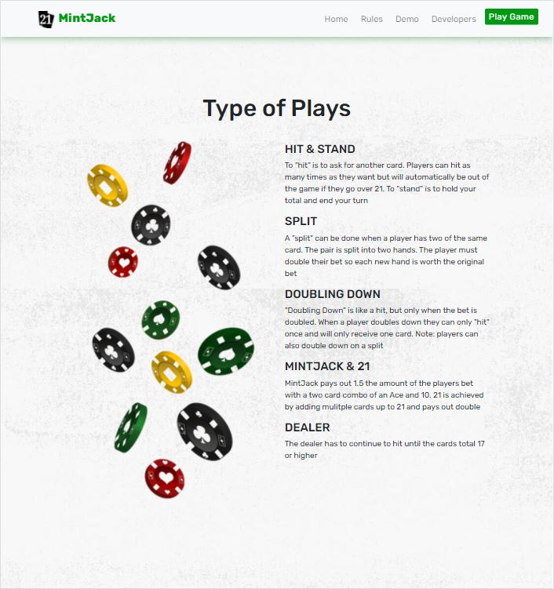

# Mint Bean Hackathon Challenge: 21 Mint Jack! 

Challenge: Build a card game with an AI component using the standard 52 card deck.

Our Project: Implement Mint(black) Jack game logic in React.

* **Click [here] to see the game in action** 
* **Link to [Blog]** 

## Images of Landing Page:




## How It's Made:

**Tech used:** [React], HTML, CSS, JavaScript, [Twitter Bootstrap], [Node.js]

Working as a team in different time zones we decided to split the work to maximize our efforts.  To create a better user experience, we opted to use our own SVG deck of cards rather than using a web API.  We wrote all the business logic in JavaScript, integrated it into our React components and add a little CSS/Bootstrap to give the project some flavor.  

## Optimizations

While we were able to finish the project and blog about our journey in the time allotted there is always room for optimization.  If we had more time, we would have ...

## Lessons Learned:

The main lesson we learned from this project was the importance of over-communicating with a team.  Since we are all in different time zones, and total strangers, we had to be very detailed regarding our progress.  We also choose to schedule out small windows of time for daily check-ins.  Implementing trust in our team was the first thing we "**installed**". 

## Installation:

```sh
- Clone repository using the command git clone git@github.com:danieljanderson/mintbean_hackathon.git
- Run the command npm install to install all dependencies 
- Run the command npm start to run the app locally 
- The app will automatically open in your browser on the following url http://localhost:3000
```


## Developers:
For more information on the developers, check out their personal portfolios:

- **[Chinonoso Igwe]** 

- **[Tami Hughes]** 

- **[Daniel Anderson]** 

## Video of Game:


[//]: # (These are reference links used in the body of this note and get stripped out when the markdown processor does its job. There is no need to format nicely because it shouldn't be seen.)

   [here]: https://21mintjack.netlify.app/
   [Blog]: https://medium.com/@thughes78/mission-hackathon-impossible-454a8607ea54
   [node.js]: <http://nodejs.org>
   [Twitter Bootstrap]: <http://twitter.github.com/bootstrap/>
   [React]: https://reactjs.org/
   [Chinonoso Igwe]: https://chiboycalix.github.io/chinonso.dev/
   [Tami Hughes]: https://www.tamsauce.com
   [Daniel Anderson]: https://danieljanderson.github.io/

https://user-images.githubusercontent.com/74758886/128003891-ba119c7b-3e04-42d3-aa6a-a8fac5370033.mp4


